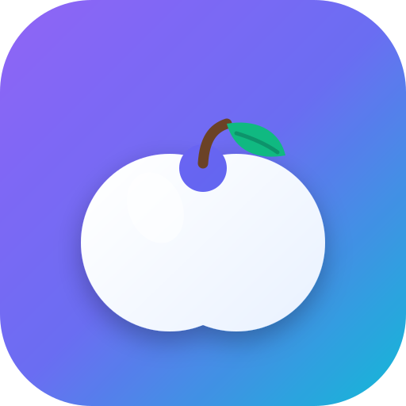

<!-- ─────────────────────────── HERO ─────────────────────────── -->


<div align="center">

### Log meals by voice in seconds — for busy people who won't open a spreadsheet.


<br/>

<a href="https://hellocal.infinitemind.space">
  
</a>
&nbsp;
<a href="#-quick-start">
  
</a>

<br/><br/>

<p align="center">
  
</p>

</div>

---

## Table of contents

- [See it in action](#-see-it-in-action)
- [Features](#-features)
- [Built with](#️-built-with)
- [Quick start](#-quick-start)
- [Cloud & AI (optional)](#-cloud--ai-optional)
- [Native apps](#-native-apps)
- [Deployment](#️-deployment)
- [Project docs](#-project-docs)
- [Contributing](#-contributing)

---

## ✨ See it in action

**Live app:** [https://hellocal.infinitemind.space](https://hellocal.infinitemind.space)

<p align="center">
  
</p>

<!-- TODO: Add product screenshots (dashboard, voice log, analytics) under .github/assets/
     and a short demo GIF/mp4. Upload video via the GitHub README editor for a native player. -->

| | |
|:--:|:--:|
| **Voice-first logging** | **Analytics & streaks** |
| Speak a meal; macros land on the dashboard. | Trends, heatmaps, and goal feedback at a glance. |
| **Barcode & recipes** | **Hydration & supplements** |
| Scan packages or save go-to meals. | Track water and daily stack without leaving the app. |

> [!TIP]
> HelloCal is **offline-first**. Everything works in the browser with no backend. Supabase and Gemini unlock account sync and server-proxied AI when you opt in.

---

## 🚀 Features

| | Feature | Description |
|--|---------|-------------|
| 🎤 | **Voice calorie logging** | Speak natural language (“chicken bowl and a latte”) and get structured macros fast. |
| ⚡ | **Frictionless dashboard** | Rings, macros, meal slots, and reorderable panels designed for on-the-go use. |
| 📊 | **Analytics** | Range views, day-of-week patterns, heatmaps, sparklines, and insight strips. |
| 📷 | **Barcode & camera** | Scan packaged food; native camera support on iOS/Android via Capacitor. |
| 💊 | **Supplements** | Track your stack with optional reminders. |
| 💧 | **Hydration & weight** | Water logging and body metrics alongside calories. |
| 📖 | **Recipe box** | Save and reuse meals; AI-assisted flows when cloud AI is configured. |
| 🔁 | **Meal templates** | One-tap re-logs for the foods you eat every day. |
| ☁️ | **Optional cloud sync** | Google / email sign-in, encrypted per-user storage, conflict handling. |
| 📱 | **PWA + native** | Installable web app; same codebase ships as Capacitor iOS & Android apps. |
| 🔒 | **Private by default** | Local storage first — no account required to track. |

> [!NOTE]
> Brand personality: **Sleek · Precise · Intelligent** — dark “Obsidian Console” UI with glass surfaces and purposeful neon feedback. See [`PRODUCT.md`](./PRODUCT.md) and [`DESIGN.md`](./DESIGN.md).

---

## 🛠️ Built with

<p align="center">
  
</p>

<p align="center">
  
  
  
  
  
  
  
  
  
</p>

---

## 📦 Quick start

> [!IMPORTANT]
> Requires **Node.js 22+**.

```bash
git clone https://github.com/bhaskaraanjana/HelloCal.git
cd HelloCal
npm install
npm run dev
```

Open the URL Vite prints (usually `http://localhost:5173`). The app runs fully offline with no env vars.

**Useful scripts**

| Command | What it does |
|---------|----------------|
| `npm run dev` | Vite dev server + HMR |
| `npm run build` | Typecheck + production build → `dist/` |
| `npm run preview` | Serve the production build locally |
| `npm test` | Unit tests (Vitest) |
| `npm run e2e` | Playwright end-to-end tests |
| `npm run lint` | ESLint |
| `npm run android` / `npm run ios` | Build, Capacitor sync, open native IDE |

---

## ☁️ Cloud & AI (optional)

Leave env vars empty for a pure local app. To enable accounts, sync, and HelloCal AI:

```bash
cp .env.example .env.local
# edit .env.local — see SUPABASE.md for full setup
```

| Variable | Description | Required |
|----------|-------------|----------|
| `VITE_SUPABASE_URL` | Supabase project URL | For cloud features |
| `VITE_SUPABASE_ANON_KEY` | Supabase anon/public key | For cloud features |
| `GEMINI_API_KEY` | Google AI Studio key — set as a **Supabase Edge Function secret**, not a `VITE_` client var | For server-proxied AI |

Then:

1. Run [`supabase/schema.sql`](./supabase/schema.sql) in the SQL editor.
2. Deploy the edge function: `supabase functions deploy gemini-proxy`
3. `supabase secrets set GEMINI_API_KEY=...`
4. Enable Email / Google auth providers as needed.

Full walkthrough: **[`SUPABASE.md`](./SUPABASE.md)**.

---

## 📱 Native apps

The same React build powers **iOS** and **Android** via [Capacitor](https://capacitorjs.com).

```bash
npm run cap:sync   # build + copy dist into android/ & ios/
npm run android    # open Android Studio
npm run ios        # open Xcode (macOS only)
```

Native bridges include camera meal capture, haptics, share/export, splash/status bar, and local meal/supplement reminders. Details: **[`NATIVE.md`](./NATIVE.md)**.

---

## 🚀 Deployment

**Live at:** [https://hellocal.infinitemind.space](https://hellocal.infinitemind.space)

Configured for **Vercel** SPA hosting (`vercel.json` rewrites all routes to `index.html`).

[](https://vercel.com/new/clone?repository-url=https://github.com/bhaskaraanjana/HelloCal)

On your host, set the same `VITE_SUPABASE_*` vars **before** build if you want cloud features in production.

```bash
npm run build
# serve dist/ with any static host, or push and let Vercel build
```

---

## 📚 Project docs

| Doc | Contents |
|-----|----------|
| [`PRODUCT.md`](./PRODUCT.md) | Users, purpose, brand personality |
| [`DESIGN.md`](./DESIGN.md) | Design tokens & Obsidian Console system |
| [`SUPABASE.md`](./SUPABASE.md) | Cloud auth, sync, Gemini proxy |
| [`NATIVE.md`](./NATIVE.md) | Capacitor / iOS / Android |
| [`docs/changes.md`](./docs/changes.md) | Version changelog |

---

## 🤝 Contributing

Contributions welcome — open an issue or submit a pull request.

1. Fork and branch from `main`
2. Keep changes focused; match existing TypeScript and design tokens
3. Run `npm test` and `npm run lint` before opening a PR

---

## 📄 License

This repository is private (`"private": true` in `package.json`). Contact the maintainer for reuse or licensing questions.

<div align="center">

**[▶ Open HelloCal](https://hellocal.infinitemind.space)** · Built for speed, clarity, and calm daily tracking.

</div>


